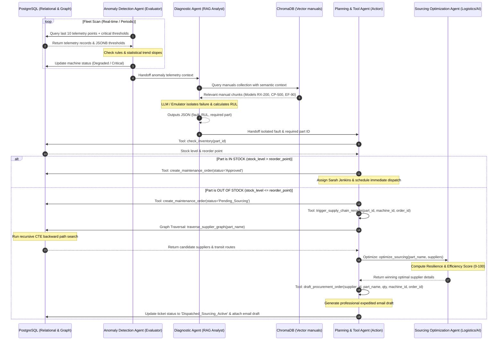

# 🧠 Industrial AI Multi-Agent Orchestrator Architecture

Welcome to the autonomic Multi-Agent Orchestrator documentation of the **Autonomic Industrial Control Tower**. This document details the architectural design, agent interactions, data flow, and database integration that allow our system to predict heavy machinery failures, diagnose mechanical/electrical root causes using vector-based RAG documentation, and orchestrate emergency supply-chain rerouting using recursive graph databases.

---

## ⚙️ Operational Telemetry & Sensor Fusion Core

The Multi-Agent Orchestration Layer is driven by a real-time **Sensor Fusion Engine** that monitors **coupled machine trains**. Because heavy industrial assets consist of mechanically connected elements—the **Driver** (electric motor), the **Coupling** (shaft & bearings), and the **Driven Component** (impeller, gear, or compressor)—a mechanical fault in one component instantly propagates to the others.

### The 4 Core Telemetry Sensors

| Telemetry Metric | Physical Sensor Type & Placement | Primary Failure Modes Detected |
| :--- | :--- | :--- |
| **Winding Temp (°C)** | **Pt100 RTDs / Thermocouples** embedded inside the stator slots of the motor housing. | Insulation breakdown, short-circuits, ventilation blocks. |
| **Vibration (mm/s)** | **Industrial IEPE Accelerometers** bolted axially and radially to bearing housings. | Rotational unbalance, shaft misalignment, bearing fatigue. |
| **Discharge Pres (Bar)**| **Ceramic/Piezo-resistive Transducers** threaded into outlet piping. | Cavitation, closed downstream gate-valves, pipe ruptures. |
| **Coil Current (Amps)** | **Split-Core Current Transformers (CTs)** clamped around power phases in the MCC. | Mechanical overload, dry running (vacuum spin), startup spikes. |

---

## ⛓️ Unified Multi-Agent Pipeline & Flow

The system orchestrates **four distinct AI agents** cooperating in a sequential workflow. Telemetry anomalies are passed as structured JSON payloads down the pipeline until the maintenance tick is resolved.



---

## 🤖 Modular Agent Definitions & Deep-Dive

### 1. Anomaly Detection Agent (Evaluator)
* **File Location**: `agent.py` -> `AnomalyDetectionAgent`
* **Responsibility**: Constantly scans raw time-series sensor telemetry and detects statistical operational anomalies.
* **Mechanism**: Performs a composite dual-layer check:
  1. **Empirical Boundary Rules**: Checks if `temperature`, `vibration`, or `current` currently exceed the critical boundaries stored in the machine’s `critical_thresholds` (JSONB), or if discharge `pressure` drops below safety bounds.
  2. **Statistical Trend Analysis**: Detects rapid thermal spikes (high slope ramp rate) or progressive vibrational increases over the last 10 readings, identifying anomalies *before* they cross the literal limit.
* **Action**: Automatically updates the machine status (`Degraded` or `Critical`) in PostgreSQL and packages the telemetry context for handoff.

### 2. Diagnostic & Root Cause Agent (RAG/Analyst)
* **File Location**: `agent.py` -> `DiagnosticAgent`
* **Responsibility**: Connects the telemetry anomaly context with actual machinery technical documentation.
* **Mechanism**: Formulates a semantic vector query combining the machine metadata, sensor readings, and anomaly reasons. It queries ChromaDB's `equipment_manuals` collection to retrieve operational and troubleshooting manuals.
* **Action**: Uses structural LLM/Emulator evaluation to isolate the precise mechanical fault, calculate Remaining Useful Life (RUL) in hours (proportional to vibrational severity), and map the fault to the specific required spare part (e.g., `PART-001` - `PART-004`).

### 3. Sourcing Optimization Agent (Logistics/AI)
* **File Location**: `agent.py` -> `SourcingOptimizationAgent`
* **Responsibility**: Calculates optimal sourcing decisions when a manufacturing emergency occurs.
* **Mechanism**: Takes a list of candidate suppliers, lead times, risk ratings, and pricing. Uses structured LLM prompt reasoning (or high-fidelity emulator fallback) to calculate a **Resilience & Efficiency Score** (0-100) prioritizing lead times (to minimize industrial downtime losses) while balancing supplier risk and unit/shipping costs.

### 4. Planning & Tool Agent (Action)
* **File Location**: `agent.py` -> `PlanningToolAgent`
* **Responsibility**: Orchestrates transactional decisions, graph database traversals, and automated email procurement drafting.
* **Tools**:
  * `check_inventory(part_id)`: Checks PostgreSQL `inventory` for stock levels vs. reorder points.
  * `create_maintenance_order(...)`: Transacts orders into the database.
  * `traverse_supplier_graph(part_name)`: PostgreSQL recursive CTE graph traversal query. Finds direct suppliers or raw-material suppliers that feed fabrication paths.
  * `draft_procurement_order(supplier_id, part_name, quantity, machine_id, order_id)`: Generates a highly professional email procurement draft addressed to the supplier's contact, citing exact machine urgency, and updates maintenance orders status to `'Dispatched_Sourcing_Active'`.
  * `trigger_supply_chain_reroute(part_id, machine_id, order_id)`: Orchestrates the entire graph routing and optimization flow.

---

## ⚡ Smart LLM Emulator Fallback Mode

To ensure the Industrial Sector AI application runs perfectly **out-of-the-box** without demanding immediate GCP credentials or commercial AI keys, `agent.py` includes a premium, high-fidelity **`SmartLLMEmulator`** class.

> [!NOTE]
> When `GEMINI_API_KEY` is present in your environment variables, the agents automatically switch to the live **Google Gemini API** (using the modern Google Generative AI or GCP Vertex AI SDKs) and request structural JSON outputs (`generation_config={"response_mime_type": "application/json"}`). When keys are missing, the `SmartLLMEmulator` evaluates telemetry mathematically, queries manual contents, maps RUL curves, and scores alternative routes with the exact same JSON format!

---

## 🔍 Supply Chain Graph Sourcing & Traversal

When a machine is failing and its required spare part is out of stock, the **Planning & Tool Agent** executes a **Recursive Common Table Expression (CTE)** graph query against the PostgreSQL database.

### The Recursive CTE Query
This query starts at the required part, traverses backward through all fabrication paths, and discovers both direct parts suppliers and raw material processors capable of assembling or shipping the unit:

```sql
WITH RECURSIVE supply_paths AS (
    -- Anchor: Start at the target part node
    SELECT 
        node_id AS current_node,
        node_name AS current_name,
        node_type AS current_type,
        ARRAY[node_id]::VARCHAR[] AS path,
        0.0 AS accumulated_price,
        0 AS accumulated_transit_days,
        CAST(NULL AS VARCHAR) AS supply_relation
    FROM supplier_graph
    WHERE node_name = %s AND node_type = 'Part'

    UNION ALL

    -- Recursive Step: Traverse backward through edges to Suppliers
    SELECT 
        g.node_id AS current_node,
        g.node_name AS current_name,
        g.node_type AS current_type,
        p.path || g.node_id AS path,
        p.accumulated_price + COALESCE(e.price, 0.0) AS accumulated_price,
        p.accumulated_transit_days + COALESCE(e.transit_time_days, 0) AS accumulated_transit_days,
        e.relationship AS supply_relation
    FROM supply_paths p
    JOIN supplier_edges e ON p.current_node = e.to_node
    JOIN supplier_graph g ON e.from_node = g.node_id
    WHERE NOT (g.node_id = ANY(p.path)) -- Prevent cyclic infinite loops
)
SELECT DISTINCT ON (current_node)
    current_node AS supplier_id,
    current_name AS supplier_name,
    current_type AS supplier_type,
    accumulated_price AS price,
    accumulated_transit_days AS transit_time_days,
    (SELECT risk_rating FROM supplier_graph WHERE node_id = current_node) AS risk_rating,
    (SELECT contact_email FROM supplier_graph WHERE node_id = current_node) AS contact_email,
    path
FROM supply_paths
WHERE current_type = 'Supplier';
```

### Multi-Attribute Decision Score Matrix
Once all candidate suppliers and transit paths are discovered, the **Sourcing Optimization Agent** evaluates each route dynamically. Every option is ranked using a custom **Resilience & Efficiency Score (0-100)**:

$$\text{Score} = 100 - (\text{Transit Days} \times 7.5) - (\text{Supplier Risk} \times 45.0) - \left(\frac{\text{Price}}{100} \times 1.5\right)$$

* **Transit Days (60% weight)**: Industrial downtime costs thousands of dollars per hour; rapid transport is highly prioritized.
* **Supplier Risk (30% weight)**: Logistical delays, custom failures, and shipping risks are heavily penalized.
* **Price (10% weight)**: Surcharges are pre-approved during emergencies, but overall cost is factored in for minor balance.

---

## 📁 Codebase Implementation Directory Map

Below is a map of the agentic orchestrator across our codebase:

* 📄 **`agent.py`**: The core execution hub. Houses the `AnomalyDetectionAgent`, `DiagnosticAgent`, `SourcingOptimizationAgent`, `PlanningToolAgent`, and `PredictiveMaintenanceOrchestrator` pipelines. Implements the database constraints updates, Chroma semantic search RAG integrations, and fallback emulator models.
* 📄 **`run_agent.py`**: The terminal execution script. Simulates IoT failures on live hardware, fires the pipeline orchestrator, injects progressive failures on templates or user-created custom machines, and outputs database audit logs.
* 📄 **`schema.sql`**: The complete relational, vector, and graph structure for PostgreSQL. Contains indexes optimized for time-series search (`idx_sensor_telemetry_machine_time`) and graph indexes (`idx_supplier_edges_from_to`).
* 📄 **`init_db.py`**: Seeds PostgreSQL and Chroma DB with manuals, supplier graphs, inventory records, and telemetry baselines for initial execution.
* 📁 **`src/app/api/`**: Next.js backend endpoint layer.
  * 📁 **`config/`**: Dynamic API route allowing the user's frontend custom fleet editor to pull/push visual configurations.
  * 📁 **`data/`**: Dashboard API route serving live PostgreSQL tables (machines, orders, telemetry) to the UI.
  * 📁 **`simulate/`**: Triggers the background multi-agent orchestrator script on request.
* 📄 **`src/app/page.js`**: React-based Control Tower Dashboard. Renders the interactive projects directory, active telemetry charts, live SVG supply-chain graphs based on dynamic graph DB traversal, and hosts the visual fleet & supply chain config editor.

---

## 🧪 Simulation Run Verification Guide

To run a simulation locally and verify the multi-agent pipeline in real-time, execute the runner script in your terminal:

```bash
# Using python directly to run the demo simulation
python run_agent.py
```

### Simulation Scenarios

#### Phase 1: In-Stock Auto-Approve & Dispatch
* **Trigger**: Detects high vibrations on Rotary Gear Pump A (`MCH-001`).
* **RAG Diagnostic**: ChromaDB returns bearing manuals; isolates bearing cage wear; estimates RUL = 36 hours; requests `PART-001`.
* **Action**: `PART-001` is IN STOCK (15 units). Dispatches ticket `#1` with status **`Approved`** directly to PdM Specialist *Sarah Jenkins*.

#### Phase 2: Out-of-Stock Sourcing & Graph Traversal
* **Trigger**: Simulates progressive stator overload on Fan B (`MCH-002`).
* **RAG Diagnostic**: Isolates stator winding breakdown; estimates RUL = 48 hours; requests `PART-004`.
* **Action**: `PART-004` is OUT OF STOCK (Stock: 1 | Reorder Point: 3). Dispatches ticket `#2` in status **`Pending_Sourcing`**.
* **Graph traversal**: Triggers backwards graph routing. Discover direct and raw suppliers.
* **Optimization**: Chosen **SKF Munich** (5-day transit, score: 59.50) to minimize emergency downtime over Shanghai Siemens (28-day transit).
* **Procurement**: Generates an expedited priority courier procurement email draft to `logistics@skf.de`. Sets database ticket status to **`Dispatched_Sourcing_Active`**.
