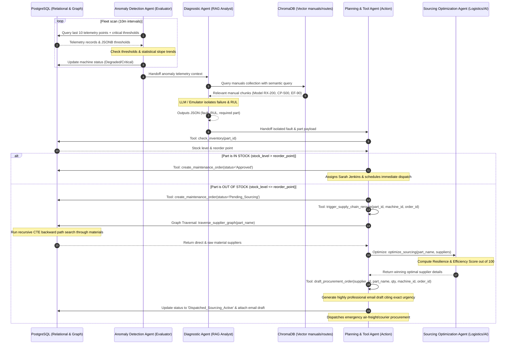

# Industrial AI Multi-Agent Orchestrator Architecture

This document details the Multi-Agent Orchestration Layer built to connect real-time Predictive Maintenance (PdM) with semantic Supply Chain Knowledge Graphs.

---

## 1. Modular Agent Definitions

### A. Anomaly Detection Agent (Evaluator)
* **Responsibility**: Scans raw time-series sensor telemetry and detects statistical operational anomalies.
* **Mechanism**: Performs a composite dual-layer check:
  1. **Empirical Boundary Rules**: Checks if `temperature`, `vibration`, or `current` currently exceed the critical boundaries stored in the machine’s `critical_thresholds` (JSONB), or if discharge `pressure` drops below safety bounds.
  2. **Statistical Trend Analysis**: Detects rapid thermal spikes (high slope ramp rate) or progressive vibrational increases over the last 10 readings, identifying anomalies *before* they cross the literal limit.
* **Action**: Automatically updates the machine status (`Degraded` or `Critical`) in PostgreSQL and packages the telemetry context for handoff.

### B. Diagnostic & Root Cause Agent (RAG/Analyst)
* **Responsibility**: Connects the telemetry anomaly context with actual machinery technical documentation.
* **Mechanism**: Formulates a semantic vector query combining the machine metadata, sensor readings, and anomaly reasons. It queries ChromaDB's `equipment_manuals` collection to retrieve operational and troubleshooting manuals.
* **Action**: Uses structural LLM/Emulator evaluation to isolate the precise mechanical fault, calculate Remaining Useful Life (RUL) in hours (proportional to vibrational severity), and map the fault to the specific required spare part (e.g., `PART-001` - `PART-004`).

### C. Sourcing Optimization Agent (Logistics/AI)
* **Responsibility**: Calculates optimal sourcing decisions when a manufacturing emergency occurs.
* **Mechanism**: Takes a list of candidate suppliers, lead times, risk ratings, and pricing. Uses structured LLM prompt reasoning (or high-fidelity emulator fallback) to calculate a **Resilience & Efficiency Score** (0-100) prioritizing lead times (to minimize industrial downtime losses) while balancing supplier risk and unit/shipping costs.

### D. Planning & Tool Agent (Action)
* **Responsibility**: Orchestrates transactional decisions, graph database traversals, and automated email procurement drafting.
* **Tools**:
  * `check_inventory(part_id)`: Checks PostgreSQL `inventory` for stock levels vs. reorder points.
  * `create_maintenance_order(...)`: Transacts orders into the database.
  * `traverse_supplier_graph(part_name)`: PostgreSQL recursive CTE graph traversal query. Finds direct suppliers or raw-material suppliers that feed fabrication paths.
  * `draft_procurement_order(supplier_id, part_name, quantity, machine_id, order_id)`: Generates a highly professional email procurement draft addressed to the supplier's contact, citing exact machine urgency, and updates maintenance orders status to `'Dispatched_Sourcing_Active'`.
  * `trigger_supply_chain_reroute(part_id, machine_id, order_id)`: Orchestrates the entire graph routing and optimization flow.

---

## 2. Verification Run Outputs (Live Demo Results)

The entire pipeline was successfully verified using `run_agent.py` against the PostgreSQL (Aiven) and ChromaDB databases:

### Phase 1: In-Stock Auto-Approve & Dispatch
1. **Anomaly Detected**: Rotary Gear Pump A (`MCH-001`) evaluated as `Degraded` due to vibration/pressure threshold violations.
2. **Postgres Update**: `MCH-001` status updated to `Degraded` in `machines`.
3. **RAG Search**: ChromaDB returned bearing manual RX-200.
4. **Diagnosis**: Isolated bearing cage wear; estimated RUL = 36 hours; required part `PART-001`.
5. **Tool Call**: `check_inventory("PART-001")` returned `stock_level = 15` (reorder point: 5).
6. **Action Execution**: `PART-001` is **IN STOCK**. Dispatched Ticket `#1` with status `'Approved'` for Sarah Jenkins.

### Phase 2: Out-of-Stock Supply Chain Rerouting & Graph Sourcing
1. **Telemetry Injected**: Progressive stator coil thermal overload on Fan B (`MCH-002`).
2. **Anomaly Detected**: `MCH-002` evaluated as `Critical` due to current and temp spikes.
3. **Diagnosis**: Isolated AC stator winding breakdown; estimated RUL = 48 hours; required part `PART-004`.
4. **Tool Call**: `check_inventory("PART-004")` returned `stock_level = 1` (reorder point: 3).
5. **Action Execution**: `PART-004` is **OUT OF STOCK** (Stock: 1 <= Reorder Point: 3).
6. **Ticket Initialized**: Dispatches Ticket `#2` with status `'Pending_Sourcing'`.
7. **Graph Traversal**: Runs PostgreSQL recursive CTE graph query for `3-Phase Electric Motor Winding`. Returns 4 candidate suppliers (direct & raw material processing options):
   * *SKF Munich* (Direct): Price: $1200, Transit: 5 days, Risk: 0.15
   * *Siemens Shanghai* (Direct): Price: $850, Transit: 28 days, Risk: 0.70
   * *CopperWorks Ohio* (Material): Price: $700, Transit: 6 days, Risk: 0.10 (Includes custom fabrication)
   * *VarnishTech Graz* (Material): Price: $750, Transit: 6 days, Risk: 0.20
8. **Sourcing Optimization**: Computes scores. Chosen **SKF Munich** (Score: 59.50) to minimize emergency downtime over Siemens Shanghai's long lead-time.
9. **Procurement Drafting**: Generates a professional email draft addressed to `logistics@skf.de` requesting expedited priority air transport and citing Fan B urgency.
10. **Database Update**: Ticket `#2` status updated to **`Dispatched_Sourcing_Active`** and attaches the email draft.

---

## 3. Database State Audit

Following the demo run, the PostgreSQL audit table shows the final system state:

### Machine Fleet Status
* `MCH-001` (Rotary Gear Pump A) -> **`Degraded`**
* `MCH-002` (High-Speed Industrial Fan B) -> **`Critical`**
* `MCH-003` (Heavy-Duty Compressor C) -> **`Degraded`**

### Dispatched Maintenance Orders
| Ticket ID | Machine ID | Priority | Status | Assigned Specialist | Summary |
| :--- | :--- | :--- | :--- | :--- | :--- |
| **#1** | `MCH-001` | High | **`Approved`** | Sarah Jenkins (PdM Specialist) | Bearing cage wear. **IN STOCK** (Stock: 15). Scheduled immediate tech dispatch. |
| **#2** | `MCH-002` | Critical | **`Dispatched_Sourcing_Active`** | Procurement & Logistics Agent | AC stator winding breakdown. **OUT OF STOCK**. **Rerouted via SKF Munich (5 days, Score: 59.50). Expedited email draft generated.** |
| **#3** | `MCH-003` | High | **`Dispatched_Sourcing_Active`** | Procurement & Logistics Agent | Cavitation leading to seal fracture. **OUT OF STOCK**. **Rerouted via Parker Hannifin Cleveland (2 days, Score: 82.23). Expedited email draft generated.** |
