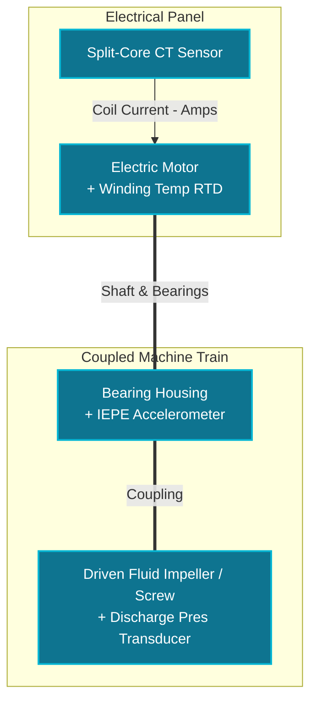
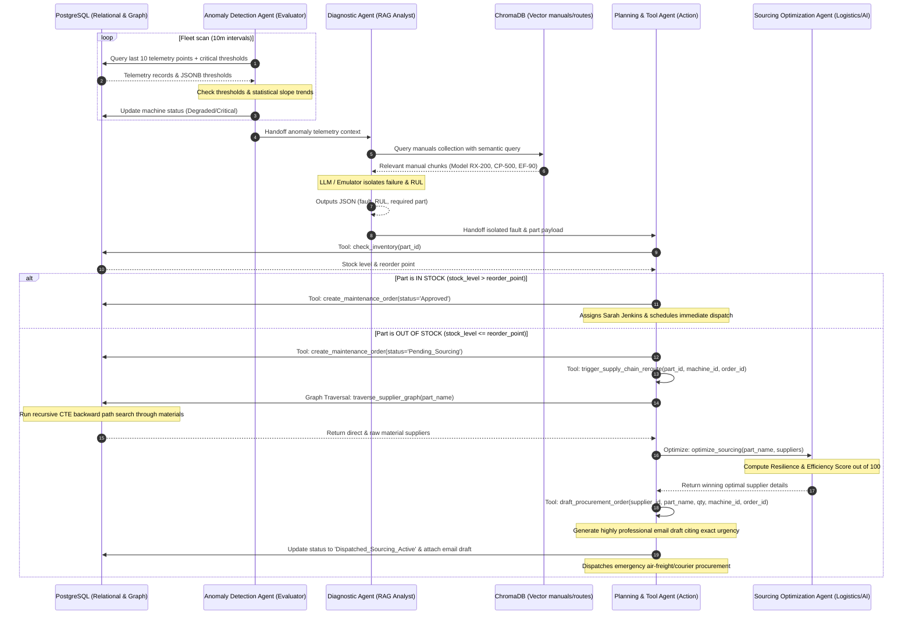

# Industrial AI Multi-Agent Orchestrator Architecture

This document details the Multi-Agent Orchestration Layer built to connect real-time Predictive Maintenance (PdM) with semantic Supply Chain Knowledge Graphs.

---

## ⚙️ Operational Telemetry & IoT Sensor Fusion Core

To understand how the **Industrial Sector AI** orchestrator predicts failures and automates maintenance, it is crucial to understand the **Sensor Fusion** engine. Rather than analyzing single isolated metrics, the control tower correlates multiple physical parameters from **coupled machine trains** (single logical assets).

Almost every heavy industrial asset consists of a **Driver** (the electric motor), a **Coupling/Transmission** (shaft & bearings), and the **Driven Component** (the pump impeller, fan blade, or compressor screw). Since these components are mechanically coupled, a defect in one instantly propagates to the others.

### 1. The 4 Core Telemetry Sensors

| Telemetry Metric | Physical Sensor Type & Placement | Failure Modes Detected |
| :--- | :--- | :--- |
| **Winding Temp (°C)** | **Pt100 RTDs or Thermocouples** embedded inside the stator slots of the electric motor housing. | Winding insulation breakdown, stator short-circuits, and severe motor ventilation cooling blockages. |
| **Vibration (mm/s)** | **Industrial IEPE Accelerometers** bolted axially and radially directly onto the bearing housings. | Rotational unbalance (dust/blade wear), shaft misalignment, structural looseness, and high-frequency bearing fatigue. |
| **Discharge Pres (Bar)**| **Ceramic/Piezo-resistive Transducers** threaded into the outlet pipe manifold of the fluid/air system. | Cavitation, closed downstream gate-valves (blockages), piping ruptures (pressure loss), and impeller degradation. |
| **Coil Current (Amps)** | **Split-Core Current Transformers (CTs)** clamped around power phases in the Motor Control Center (MCC). | Mechanical overload (fighting resistance), dry running/loss-of-load (spinning in vacuum), and startup inrush peaks. |

### 2. Coupled Machine Train Sensor Topology

The diagram below illustrates how these four sensors are physically distributed across a single unified asset (e.g., a coupled pump station):



### 3. Pre-Seeded Real-World Assets Analysed by the AI

This web application simulates and analyzes three primary coupled machine templates in real-time:

* **High-Speed Industrial Fan (`MCH-002`)**: Used for fume and toxic dust extraction. Common failure: dust deposits on the fan blade trigger rotational unbalance, causing high vibration velocity at the bearings, which the AI agent diagnoses as bearing wear.
* **Rotary Gear/Chemical Pump (`MCH-001`)**: Used to transport high-pressure fluids. Common failure: dry running (fluid loss), causing discharge pressure to fall to zero and motor coil current to drop significantly as the impeller spins without load.
* **Heavy-Duty Compressor (`MCH-003`)**: Supplies pneumatic power to the assembly line. Common failure: system leakage, forcing the compressor to stay loaded continuously, driving winding temperatures past the critical threshold.

---



---

## 1. Modular Agent Definitions

### A. Anomaly Detection Agent (Evaluator)
* **Responsibility**: Scans raw time-series sensor telemetry and detects statistical operational anomalies.
* **Mechanism**: Performs a composite dual-layer check:
  1. **Empirical Boundary Rules**: Checks if `temperature`, `vibration`, or `current` currently exceed the critical boundaries stored in the machine’s `critical_thresholds` (JSONB), or if discharge `pressure` drops below safety bounds.
  2. **Statistical Trend Analysis**: Detects rapid thermal spikes (high slope ramp rate) or progressive vibrational increases over the last 10 readings, identifying anomalies *before* they cross the literal limit.
* **Action**: Automatically updates the machine status (`Degraded` or `Critical`) in PostgreSQL and packages the telemetry context for handoff.

### B. Diagnostic & Root Cause Agent (RAG/Analyst)
* **Responsibility**: Connects the telemetry anomaly context with actual machinery technical documentation.
* **Mechanism**: Formulates a semantic vector query combining the machine metadata, sensor readings, and anomaly reasons. It queries ChromaDB's `equipment_manuals` collection to retrieve operational and troubleshooting manuals.
* **Action**: Uses structural LLM/Emulator evaluation to isolate the precise mechanical fault, calculate Remaining Useful Life (RUL) in hours (proportional to vibrational severity), and map the fault to the specific required spare part (e.g., `PART-001` - `PART-004`).

### C. Sourcing Optimization Agent (Logistics/AI)
* **Responsibility**: Calculates optimal sourcing decisions when a manufacturing emergency occurs.
* **Mechanism**: Takes a list of candidate suppliers, lead times, risk ratings, and pricing. Uses structured LLM prompt reasoning (or high-fidelity emulator fallback) to calculate a **Resilience & Efficiency Score** (0-100) prioritizing lead times (to minimize industrial downtime losses) while balancing supplier risk and unit/shipping costs.

### D. Planning & Tool Agent (Action)
* **Responsibility**: Orchestrates transactional decisions, graph database traversals, and automated email procurement drafting.
* **Tools**:
  * `check_inventory(part_id)`: Checks PostgreSQL `inventory` for stock levels vs. reorder points.
  * `create_maintenance_order(...)`: Transacts orders into the database.
  * `traverse_supplier_graph(part_name)`: PostgreSQL recursive CTE graph traversal query. Finds direct suppliers or raw-material suppliers that feed fabrication paths.
  * `draft_procurement_order(supplier_id, part_name, quantity, machine_id, order_id)`: Generates a highly professional email procurement draft addressed to the supplier's contact, citing exact machine urgency, and updates maintenance orders status to `'Dispatched_Sourcing_Active'`.
  * `trigger_supply_chain_reroute(part_id, machine_id, order_id)`: Orchestrates the entire graph routing and optimization flow.

---

## 2. Verification Run Outputs (Live Demo Results)

The entire pipeline was successfully verified using `run_agent.py` against the PostgreSQL (Aiven) and ChromaDB databases:

### Phase 1: In-Stock Auto-Approve & Dispatch
1. **Anomaly Detected**: Rotary Gear Pump A (`MCH-001`) evaluated as `Degraded` due to vibration/pressure threshold violations.
2. **Postgres Update**: `MCH-001` status updated to `Degraded` in `machines`.
3. **RAG Search**: ChromaDB returned bearing manual RX-200.
4. **Diagnosis**: Isolated bearing cage wear; estimated RUL = 36 hours; required part `PART-001`.
5. **Tool Call**: `check_inventory("PART-001")` returned `stock_level = 15` (reorder point: 5).
6. **Action Execution**: `PART-001` is **IN STOCK**. Dispatched Ticket `#1` with status `'Approved'` for Sarah Jenkins.

### Phase 2: Out-of-Stock Supply Chain Rerouting & Graph Sourcing
1. **Telemetry Injected**: Progressive stator coil thermal overload on Fan B (`MCH-002`).
2. **Anomaly Detected**: `MCH-002` evaluated as `Critical` due to current and temp spikes.
3. **Diagnosis**: Isolated AC stator winding breakdown; estimated RUL = 48 hours; required part `PART-004`.
4. **Tool Call**: `check_inventory("PART-004")` returned `stock_level = 1` (reorder point: 3).
5. **Action Execution**: `PART-004` is **OUT OF STOCK** (Stock: 1 <= Reorder Point: 3).
6. **Ticket Initialized**: Dispatches Ticket `#2` with status `'Pending_Sourcing'`.
7. **Graph Traversal**: Runs PostgreSQL recursive CTE graph query for `3-Phase Electric Motor Winding`. Returns 4 candidate suppliers (direct & raw material processing options):
   * *SKF Munich* (Direct): Price: $1200, Transit: 5 days, Risk: 0.15
   * *Siemens Shanghai* (Direct): Price: $850, Transit: 28 days, Risk: 0.70
   * *CopperWorks Ohio* (Material): Price: $700, Transit: 6 days, Risk: 0.10 (Includes custom fabrication)
   * *VarnishTech Graz* (Material): Price: $750, Transit: 6 days, Risk: 0.20
8. **Sourcing Optimization**: Computes scores. Chosen **SKF Munich** (Score: 59.50) to minimize emergency downtime over Siemens Shanghai's long lead-time.
9. **Procurement Drafting**: Generates a professional email draft addressed to `logistics@skf.de` requesting expedited priority air transport and citing Fan B urgency.
10. **Database Update**: Ticket `#2` status updated to **`Dispatched_Sourcing_Active`** and attaches the email draft.

---

## 3. Database State Audit

Following the demo run, the PostgreSQL audit table shows the final system state:

### Machine Fleet Status
* `MCH-001` (Rotary Gear Pump A) -> **`Degraded`**
* `MCH-002` (High-Speed Industrial Fan B) -> **`Critical`**
* `MCH-003` (Heavy-Duty Compressor C) -> **`Degraded`**

### Dispatched Maintenance Orders
| Ticket ID | Machine ID | Priority | Status | Assigned Specialist | Summary |
| :--- | :--- | :--- | :--- | :--- | :--- |
| **#1** | `MCH-001` | High | **`Approved`** | Sarah Jenkins (PdM Specialist) | Bearing cage wear. **IN STOCK** (Stock: 15). Scheduled immediate tech dispatch. |
| **#2** | `MCH-002` | Critical | **`Dispatched_Sourcing_Active`** | Procurement & Logistics Agent | AC stator winding breakdown. **OUT OF STOCK**. **Rerouted via SKF Munich (5 days, Score: 59.50). Expedited email draft generated.** |
| **#3** | `MCH-003` | High | **`Dispatched_Sourcing_Active`** | Procurement & Logistics Agent | Cavitation leading to seal fracture. **OUT OF STOCK**. **Rerouted via Parker Hannifin Cleveland (2 days, Score: 82.23). Expedited email draft generated.** |

---

## 🖥️ Standalone Tauri Desktop Client (Zero-Dependency)

The **Industrial Sector AI** control tower is fully wrap-packaged into a native desktop application using **Tauri v2**. It is configured to build as a **completely zero-dependency (standalone)** installer for Windows.

### ⚙️ How it Works under the Hood
* **Bundled Node.js & Next.js Server**: When Next.js compiles using `output: 'standalone'`, the server logic is minified and self-contained. During the build phase, Tauri packages a portable Node.js executable directly into the application's resources. In production, Tauri resolves this resource path and runs the Next.js server locally on port 3160 using the packaged Node.js binary.
* **Compiled Python Daemon**: The Python telemetry daemon (`backend/daemon.py`) is compiled using PyInstaller into a standalone executable (`daemon.exe`) that embeds the Python interpreter and all python package dependencies (such as `paho-mqtt`, `psycopg2`, `dotenv`).
* **Rust Process Supervisor (`src-tauri/src/lib.rs`)**: Tauri manages the lifecycle of these two child processes. It spawns the Next.js server and Python daemon directly from its resources folder and intercepts the exit event to cleanly terminate the process trees, avoiding orphaned background tasks.
* **Zero Prerequisites**: Recipients can install and run the resulting `.msi` or `.exe` immediately on any Windows computer—even if they do not have Node.js, npm, or Python installed!

### 📦 Building & Distributing the Standalone Installer

To compile the standalone installer on your development machine (requires the Rust toolchain):

1. **Build and Assemble Standalone Resources**:
   Run the resource bundler script to compile Next.js in standalone mode, compile the Python daemon to an executable, and copy the required local binary files to the Tauri resource directories:
   ```bash
   node scripts/build-desktop-resources.js
   ```

2. **Generate the Tauri Installer Package**:
   Build the release bundle:
   ```bash
   npm run desktop:build
   ```
   Tauri will output the installers in:
   * **Windows Installer (.msi)**: `src-tauri/target/release/bundle/msi/control-tower_0.1.0_x64_en-US.msi`
   * **Standalone Executable (.exe)**: `src-tauri/target/release/control-tower.exe`

3. **Share & Install**:
   Send the `.msi` file to other users. They double-click to install, creating desktop/start menu shortcuts to launch the control tower offline or online instantly.
