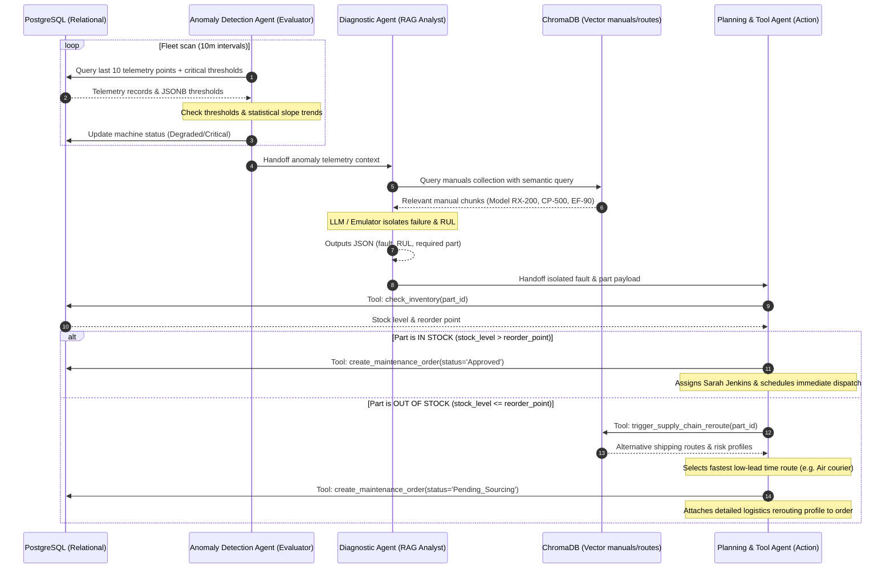

# Industrial AI Multi-Agent Orchestrator Architecture

This document details the Multi-Agent Orchestration Layer built to connect real-time Predictive Maintenance (PdM) with semantic Supply Chain Knowledge Graphs.

---

## 1. Modular Agent Definitions

### A. Anomaly Detection Agent (Evaluator)
* **Responsibility**: Scans raw time-series sensor telemetry and detects statistical operational anomalies.
* **Mechanism**: Performs a composite dual-layer check:
  1. **Empirical Boundary Rules**: Checks if `temperature`, `vibration`, or `current` currently exceed the critical boundaries stored in the machine’s `critical_thresholds` (JSONB), or if discharge `pressure` drops below safety bounds.
  2. **Statistical Trend Analysis**: Detects rapid thermal spikes (high slope ramp rate) or progressive vibrational increases over the last 10 readings, identifying anomalies *before* they cross the literal limit.
* **Action**: Automatically updates the machine status (`Degraded` or `Critical`) in PostgreSQL and packages the telemetry context for handoff.

### B. Diagnostic & Root Cause Agent (RAG/Analyst)
* **Responsibility**: Connects the telemetry anomaly context with actual machinery technical documentation.
* **Mechanism**: Formulates a semantic vector query combining the machine metadata, sensor readings, and anomaly reasons. It queries ChromaDB's `equipment_manuals` collection to retrieve operational and troubleshooting manuals.
* **Action**: Uses structural LLM/Emulator evaluation to isolate the precise mechanical fault, calculate Remaining Useful Life (RUL) in hours (proportional to vibrational severity), and map the fault to the specific required spare part (e.g., `PART-001` - `PART-004`).

### C. Planning & Tool Agent (Action)
* **Responsibility**: Orchestrates transactional decisions based on part availability and logistics.
* **Tools**:
  * `check_inventory(part_id)`: Checks PostgreSQL `inventory` for stock levels vs. reorder points.
  * `create_maintenance_order(machine_id, priority, root_cause, status, assigned_technician)`: Transacts orders into the database.
  * `trigger_supply_chain_reroute(part_id)`: Queries ChromaDB's `supplier_routes` collection for alternative suppliers, transits, and risk profiles.
* **Branches**:
  * **In-Stock Branch**: If parts are above reorder points, creates a maintenance order with status `'Approved'`, schedules a technician, and locks inventory.
  * **Out-of-Stock Branch**: If parts are below reorder limits, creates the order with status `'Pending_Sourcing'` (check constraints modified in PostgreSQL automatically to support this) and runs the supplier routes vector query to identify the fastest expedited courier (e.g. Air freight), adding the logistical dispatch report to the ticket.

---

## 2. Verification Run Outputs (Live Demo Results)

The entire pipeline was successfully verified using `run_agent.py` against the PostgreSQL (Aiven) and ChromaDB databases:

### Phase 1: In-Stock Auto-Approve & Dispatch
1. **Anomaly Detected**: Rotary Gear Pump A (`MCH-001`) evaluated as `Critical` due to vibration/temperature limits.
2. **Postgres Update**: `MCH-001` status updated to `Critical` in `machines`.
3. **RAG Search**: ChromaDB returned bearing manual RX-200.
4. **Diagnosis**: Isolated bearing cage wear; estimated RUL = 10 hours; required part `PART-001`.
5. **Tool Call**: `check_inventory("PART-001")` returned `stock_level = 15` (reorder point: 5).
6. **Action Execution**: `PART-001` is **IN STOCK**. Dispatched Ticket `#4` with status `'Approved'` for Sarah Jenkins.

### Phase 2: Out-of-Stock Supply Chain Rerouting
1. **Telemetry Injected**: Simulates progressive electrical phase degradation on Fan B (`MCH-002`).
2. **Anomaly Detected**: `MCH-002` evaluated as `Critical` due to motor current/winding temperature spikes.
3. **Postgres Update**: `MCH-002` status updated to `Critical`.
4. **RAG Search**: ChromaDB returned fan manual chunk EF-90.
5. **Diagnosis**: Isolated AC stator winding breakdown; estimated RUL = 14 hours; required part `PART-004`.
6. **Tool Call**: `check_inventory("PART-004")` returned `stock_level = 1` (reorder point: 3).
7. **Action Execution**: `PART-004` is **LOW STOCK**.
8. **Supply Chain Query**: Queries ChromaDB's `supplier_routes` for `PART-004`. Retrieves alternative routes. Identifies Siemens air cargo shipping (Shanghai) as the fastest route (lead time: 2 days, cost: $180, risk: LOW).
9. **Action Execution**: Dispatches Ticket `#7` with status `'Pending_Sourcing'`, assigning Procurement & Logistics and attaching the full logistics route to the ticket!

---

## 3. Database State Audit

Following the demo run, the PostgreSQL audit table shows the final system state:

### Machine Fleet Status
* `MCH-001` (Rotary Gear Pump A) -> **`Critical`**
* `MCH-002` (High-Speed Industrial Fan B) -> **`Critical`**
* `MCH-003` (Heavy-Duty Compressor C) -> **`Degraded`**

### Active Maintenance Orders Dispatched
| Ticket ID | Machine ID | Priority | Status | Assigned Specialist | Summary |
| :--- | :--- | :--- | :--- | :--- | :--- |
| **#4** | `MCH-001` | Critical | **`Approved`** | Sarah Jenkins (PdM Specialist) | Main bearing cage wear. **IN STOCK** (Stock: 15). Scheduled immediate tech dispatch. |
| **#7** | `MCH-002` | Critical | **`Pending_Sourcing`** | Procurement & Logistics Agent / Sarah Jenkins | AC stator winding breakdown. **OUT OF STOCK** (Stock: 1, Reorder Triggered). **Rerouted via SKF Munich/Parker Hannifin Courier (2 days, LOW risk).** |
